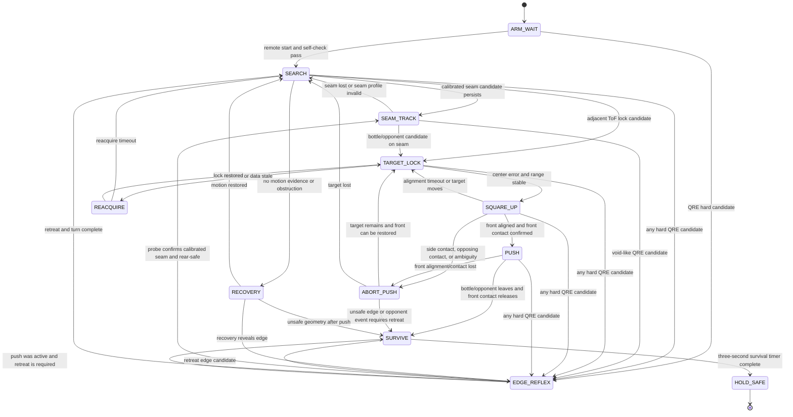

# Table-Sumo Robot: Sensor and Strategy Design v1

Status: Phases 1-3 design review; no implementation authorization yet
Date: 2026-08-14
MCU: ESP32-S3, one controller
Baseline sensor set: 5 VL53L0X-class ToF heads, 4 analog QRE1113 heads

## Approval boundary

This document completes the research and design proposal only. It does not
authorize firmware, wiring changes, PCB changes, or a real-robot test. Phase 4
starts only after the operator approves the Phase 2 and Phase 3 decisions below.

The competition facts supplied in the task, and the repository rules digest in
`docs/competition/table-sumo-rules-2026.md`, are the controlling 2026 rules. External BottleSumo and sumo
sources are used for engineering context only; they do not override the local
rules.

## 1. Phase 1: research

### 1.1 Evidence boundary

The following are direct facts from the supplied rules, the repository, or the
listed device documentation:

- The senior arena can be two offset boards, so the walkable surface can be
  non-convex. The bottle lies somewhere on the joint line. [R1]
- A table edge is detected by the surface disappearing. A tape seam is a
  different event and is not a safe fixed threshold. [R1]
- VL53L0X devices power up at address `0x29`; XSHUT sequencing is required to
  assign addresses. [S2, S3]
- The VL53L0X carrier documentation lists a nominal 25 deg FoV, up to 2 m
  nominal range, 20 mA typical active current, 40 mA peak current, and 400 kHz
  I2C operation. Effective range depends on target and environment; use the
  task's approximately 1.2 m usable-indoor planning value until bench data
  replaces it. [R2, S3]
- The VL53L1X has a programmable ROI, typical 27 deg FoV, short mode around
  1.3 m, and up to 50 Hz short-mode sampling on the cited carrier. [S4]
- ESP32-S3 has two I2C interfaces, two 12-bit SAR ADCs, and ADC2 cannot be used
  with Wi-Fi simultaneously. GPIO0, GPIO3, GPIO45, and GPIO46 are strapping
  pins. [S5]
- The QRE1113 is a 940 nm IR LED plus phototransistor. Its datasheet example
  uses a 1 mm reflector distance; its response varies strongly with distance,
  reflectance, forward current, and ambient conditions. [S6]
- A prior BottleSumo ruleset explicitly defines intentional pushing as contact
  through a sensor-equipped side without contact with the other robot, and
  requires three-second survival. It is useful context, but the supplied 2026
  rules remain authoritative. [S7]

Engineering inferences are labeled as such below. No claim in this document is
physical proof for this robot.

### 1.2 ToF count trade-off: 3 vs 4 vs 5

For a 25 deg full FoV, the nominal transverse footprint at range `d` is:

`width(d) = 2 * d * tan(12.5 deg) = 0.443 * d`

Approximate footprint widths are 13.3 cm at 30 cm, 22.2 cm at 50 cm, 44.3 cm
at 1 m, and 53.2 cm at 1.2 m. Therefore one sensor cannot cover a 75 cm board
width at its practical VL53L0X range. The robot needs motion and a search
pattern; more sensors improve local angular coverage, not whole-arena vision.

| Count | Useful arrangement | Benefit | Cost and blind-zone risk |
|---|---|---|---|
| 3 | Front left, center, right | Lowest GPIO, power, and polling cost; enough for coarse centering | A narrow bottle can fall between beams; one failed head removes a large part of the front arc; little height/profile redundancy |
| 4 | Four contiguous front headings, or two front plus two rear | Better width estimate and some rear recovery awareness | No spare head for a second beam height; four one-shot readings increase stale-data age; two-front/two-rear weakens front lock-on |
| 5 | Three low front heads plus two mid-height outer heads | Contiguous front arc, fallen-bottle coverage, a second height for a tall opponent, and one-head fault tolerance | Five XSHUT lines, about 100 mA typical ToF current, more optical crosstalk testing, and a longer round-robin schedule |

Recommendation: use 5 heads if the actual ESP32-S3 board exposes the proposed
GPIOs and the mechanical bracket fits. A 4-head build is the fallback. Do not
choose 5 merely to claim long-range arena coverage; the search motion is still
mandatory.

Polling cost is dominated by the measurement budget, not the short I2C register
transactions. With a 33 ms budget and a conservative non-overlapping optical
schedule, one bus carrying `n` heads needs approximately `33*n` ms for a
complete fresh set, before bus overhead. A split of 3+2 heads therefore has a
worst bus schedule of about 99 ms, or roughly 10 Hz for the slow bus; a 2+2
four-head split is about 66 ms, or 15 Hz. A single global five-head optical
schedule is about 165 ms, or 6 Hz. The per-head measurement cadence can be
staggered, but the fusion layer must use the age of the oldest required sample,
not the nominal 30 Hz headline. At 400 kHz, the I2C start/status/range reads
are normally a few milliseconds or less and should be measured rather than
assumed. The two ESP32-S3 buses reduce transaction contention, but only a
physical crosstalk test permits overlapping exposures.

Each head adds one XSHUT GPIO and its power/ground branch. SDA and SCL remain
shared per bus. The incremental resource count is therefore approximately:

| Count | XSHUT GPIOs | I2C bus pins | Typical active ToF current | Conservative fresh-set schedule |
|---:|---:|---:|---:|---:|
| 3 | 3 | 2 or 4 | 60 mA | 66-99 ms depending on split |
| 4 | 4 | 4 if split 2+2 | 80 mA | about 66 ms |
| 5 | 5 | 4 if split 3+2 | 100 mA | about 99 ms split, 165 ms globally |

Coverage blind zones have two distinct causes. For heading separation `delta`
and a 25 deg FoV, the nominal angular gap is
`max(0, delta - 25 deg)`, with an approximate transverse gap
`2*d*tan(gap/2)` at range `d`. A 5 deg gap is about 4.4 cm at 0.5 m and
8.7 cm at 1 m; a 20 deg gap is about 17.6 cm and 35.3 cm. The proposed low
row uses 25 deg spacing, so it has no nominal angular gap, but a small bottle
can still be missed because of reflectance, target height, occlusion, and
non-overlap at the edges of real sensor response. Three heads have no spare
height or fault tolerance. Four heads can widen the same-height arc or add
rear awareness, but cannot provide both the low-row bottle coverage and the
mid-row opponent coverage without compromise. Five heads buy height/profile
redundancy and a wider arc at the cost of the schedule above.

### 1.3 ToF mounting geometry

The recommended front geometry is a 95 deg nominal front arc:

- `T0` low-left: optical center 70 mm above the table plane, 55 mm left of the
  robot centerline, yaw -25 deg from the marked front normal.
- `T1` low-center: optical center 70 mm above the table plane, centerline, yaw
  0 deg.
- `T2` low-right: optical center 70 mm above the table plane, 55 mm right of
  the centerline, yaw +25 deg.
- `T3` mid-left: optical center 130 mm above the table plane, 90 mm left of
  the centerline, yaw -35 deg.
- `T4` mid-right: optical center 130 mm above the table plane, 90 mm right of
  the centerline, yaw +35 deg.

The low trio covers the central arc with contiguous nominal 25 deg cones; real
module response may add or remove useful overlap. It is the primary detector
for a bottle lying on its side. The two outer heads extend
the arc and give a second height for an opponent with a taller front. The
low-center head must remain the authoritative approach head; the mid heads
must never be the only evidence used to attack a fallen bottle.

Mounting requirements:

- Measure every height from the laminate surface to the optical window center,
  not from the PCB or chassis.
- Keep the low beam at 65-75 mm. A horizontal bottle with an approximately
  100 mm high profile can intersect that beam; a 130 mm-only design could pass
  above it.
- Keep all heads square to their intended yaw. Do not use a common tilted
  bracket unless the actual pitch is measured and included in calibration.
- Use matte-black, non-glossy dividers or short hoods between adjacent windows.
  They must not intrude into the nominal 25 deg cones. Separate emitters
  physically and avoid pointing adjacent heads directly at each other.
- Do not start two overlapping optical exposures at the same time until a
  bench crosstalk test proves it safe. Two I2C buses reduce bus transaction
  contention; they do not automatically remove optical interference.
- Use the latest timestamp with each range. A stale or invalid range is not a
  target lock and cannot suppress the edge reflex.

VL53L1X upgrade decision: it is worth considering only if the operator has to
  buy new heads. Its longer range, ROI, and short/medium/long distance modes
  are useful for reducing false returns and narrowing a front beam, but the
  bottle is local and the arena still exceeds one sensor footprint. Replacing
  working VL53L0X heads is not the first priority. The upgrade also changes
  library/API and electrical validation risk. Baseline recommendation: keep
  VL53L0X-class heads for the first hardware gate; choose VL53L1X for a new
  build only if the price and driver support are acceptable and the ROI is
  needed after bench tests.

### 1.4 Bottle versus opponent

ToF-only discrimination is probabilistic, not a rule-grade identification:

- Motion: a bottle should remain fixed in world coordinates until pushed; an
  opponent can change range or bearing independently of the robot's commanded
  motion. This is useful only over several samples and is weak if the opponent
  pauses or the robot has no wheel feedback.
- Width: adjacent low heads returning similar distances suggest a broad robot;
  a single central return suggests a narrow bottle. The 25 deg cones overlap,
  so this is a relative feature, not a measured physical width.
- Distance stability: pause or creep for 200-500 ms. A static object produces a
  repeatable local geometry; a moving opponent produces inconsistent bearing or
  range. Wrinkles, a shiny object, and ToF noise can look similar.
- Height: the low row is intentionally biased toward the fallen bottle. The
  mid row can increase opponent confidence but cannot prove identity.

The classifier must expose `unknown`, `probable_bottle`, and
`probable_opponent`, not a binary fact. The push state requires front alignment
and contact evidence regardless of the label.

Optional cheap addition: one RGB/color sensor can help confirm an upright
bottle, but it is not required for the first build. Mount its optical center
at 99-100 mm above the table so the 3.8 cm band centered around the stated 8 cm
bottom offset is in view. Calibrate against the actual white wrapper and the
actual band during inspection; do not hardcode a color. Use a shroud and
controlled LED illumination. A sensor such as TCS34725 commonly uses address
`0x29`, so put it on a separate I2C bus or otherwise isolate it from the ToF
heads. An APDS-9960-class device avoids that address collision but still needs
ambient-light calibration. Color confirmation helps upright bottles; it is
unreliable when the bottle is horizontal or occluded and does not identify an
opponent. The more valuable optional addition for the intentional-push rule is
two low-profile front contact switches or a front contact strip.

### 1.5 QRE1113 layout and stopping distance

Use four analog sensors as four-corner edge sentinels, not as a line-following
array. The analog/digital choice matters:

- Analog/raw QRE output preserves the reflectance value. It permits separate
  table, tape, and void clusters, ambient compensation, margin measurement,
  and a seam probe. It costs four ADC inputs and ADC sampling time. Keep those
  inputs on ADC1, even if pit telemetry later uses Wi-Fi.
- A digital QRE module adds a comparator and gives a fast thresholded event. It
  is simpler and can feed an interrupt-capable digital input, but its
  threshold/hysteresis may be fixed or set by a potentiometer, and it cannot
  reliably distinguish a tape seam from a true void from one reading. It still
  needs a motion probe and on-site threshold check.

Recommendation: use the analog version if that is what the operator has. If
the operator has only a digital module, use it as a conservative two-state
edge candidate and disable seam tracking unless repeated seam probing proves
safe. Do not assume a module's silkscreen `D0` or `A0` polarity until it is
measured.

The edge path is "interrupt-class" in priority and behavior, not necessarily a
GPIO interrupt. For raw analog sensors, the safety task must sample at the
target rate and latch a hard candidate immediately; an ISR must not perform
ADC, I2C, or motor-library work. A digital comparator can additionally trigger
an ISR, but the ISR should only latch the event and let the safety task command
the motor override.

Layout:

- Front-left and front-right optical centers: 70 mm left/right of the robot
  centerline and 75 mm ahead of the front drive-wheel contact line.
- Rear-left and rear-right optical centers: 70 mm left/right of centerline and
  75 mm behind the rear drive-wheel contact line.
- Set the adjustable sensor-to-laminate gap to 2.0-3.0 mm. QRE1113's data sheet
  example is near 1 mm, but the competition requires at least 2 mm ground
  clearance except for permitted drive/essential structures. Actual gap and
  readings must be measured on the chosen module.
- Keep any body, wedge, or wheel structure no more than 10 mm ahead of the
  front sensor line if possible. The front optical line is the early-warning
  reference, not the bumper tip.

The braking calculation is:

`D_required = v * T_total + v^2 / (2 * a_effective) + D_margin`

where `T_total` includes ADC sampling, classification, task scheduling, and
motor command response. For illustration only, with `T_total = 20 ms`,
`a_effective = 1.5 m/s^2`, and `D_margin = 15 mm`:

- at 0.25 m/s, `D_required` is about 41 mm;
- at 0.35 m/s, `D_required` is about 63 mm.

The proposed 75 mm sensor lookahead leaves margin in that illustrative model.
It is not a speed approval: real attack speed is capped by the edge-reflex
milestone, and the operator will increase speed until the first controlled
failure. If the measured reaction plus braking time is 80 ms, the same values
become approximately 56 mm and 84 mm; the 0.35 m/s cap then fails the proposed
geometry and must be reduced or moved forward.

The seam classifier uses three calibrated clusters per sensor: table surface,
tape seam, and true void. A tape-like reading that returns to the table after
a short crossing is a `SEAM_CANDIDATE`, not a hard edge. A void-like reading
that is indistinguishable from the edge cluster is always treated
conservatively as an edge candidate. The robot probes by stopping, checking
rear surface presence, reversing only if rear-safe, and sampling again. If the
surface returns within the calibrated seam width, resume at a low seam speed;
otherwise retreat and turn away. No reflectance-only method can guarantee a
distinction when tape and void have identical optical readings, so this probe
is required and the residual ambiguity remains a risk.

### 1.6 Strategy research and design implications

The BottleSumo rules and prior event material consistently emphasize edge
detection, object detection, autonomous search, adaptation to unknown fields,
and three-second survival. A Pololu competition report describes four corner
reflectance sensors and front/side/rear proximity sensors, and also reports
that an unstructured random strategy spent too much time near the border. A
separate report describes roaming or spinning search patterns but also shows
that target angle and sensor height require tuning. These are reports from
other events, not proof of this arena. [S7, S8, S9]

The design therefore uses:

- interior-biased short chords and arcs, not a rectangle perimeter;
- continuous edge vigilance during every search and attack segment;
- an optional seam-track mode only after the seam signature is calibrated and
  repeatable; and
- front-square, straight pushing with no spin or side scrape while a bottle is
  in contact.

## 2. Phase 2: sensor and electrical architecture

### 2.1 Firmware platform decision

Recommendation: PlatformIO with the Arduino framework, using its ESP32-S3
FreeRTOS primitives and C++ libraries. This keeps the existing `.ino` movement
starting point and simplifies VL53L0X-class library integration while still
allowing pinned tasks, queues, watchdogs, ADC sampling, and direct GPIO control.
Do not run Wi-Fi during a match. Use USB serial for adjustment and optionally
enable a pit-only AP page later. Move to native ESP-IDF only if the selected
ToF driver or ADC timing cannot meet the measured gates.

### 2.2 I2C buses and XSHUT

The following is a proposed map for a bare ESP32-S3 or a board that exposes
these pins. It must be reconciled with the exact module schematic before wiring.

| Bus | SDA | SCL | Devices | Assigned addresses |
|---|---:|---:|---|---|
| I2C0 | GPIO8 | GPIO9 | T0, T1, T2 | 0x30, 0x31, 0x32 |
| I2C1 | GPIO10 | GPIO11 | T3, T4 | 0x33, 0x34 |

Proposed XSHUT lines:

| Head | Role | XSHUT GPIO | Bring-up order |
|---|---|---:|---:|
| T0 | low-left | GPIO12 | 1 |
| T1 | low-center | GPIO13 | 2 |
| T2 | low-right | GPIO16 | 3 |
| T3 | mid-left | GPIO18 | 4 |
| T4 | mid-right | GPIO21 | 5 |

Hold all XSHUT lines low with external pulldowns during reset if the carrier
does not already provide a reliable disabled state. Raise one head, confirm
`0x29`, assign its address, verify the new address, then continue. On every
power cycle the addresses must be assigned again. Use one effective I2C pull-up
pair per bus, normally 2.2-4.7 kohm to 3.3 V after checking and removing
duplicate carrier pull-ups. Keep the buses at 400 kHz only after signal
integrity is proven.

The two buses are separated by sensing group, not because they make five
optical exposures safe to run simultaneously. The initial schedule is
round-robin with non-overlapping exposures for adjacent optical cones. A bench
test may permit offset parallel bus operation; otherwise use a global optical
timeslot and accept the slower update rate.

### 2.3 ESP32-S3 pin budget

| GPIO | Proposed use | Direction/type | Decision and warning |
|---:|---|---|---|
| 1 | Left PWM | output | Existing movement firmware contract; also ADC1-capable but not used as analog |
| 2 | Left direction | output | Existing movement firmware contract; also ADC1-capable but not used as analog |
| 3 | unused | - | Avoid: strapping/JTAG selection pin |
| 4 | QRE front-left analog | ADC1 input | Preferred analog input |
| 5 | QRE front-right analog | ADC1 input | Preferred analog input |
| 6 | QRE rear-left analog | ADC1 input | Preferred analog input |
| 7 | QRE rear-right analog | ADC1 input | Preferred analog input |
| 8 | I2C0 SDA | bidirectional | Digital bus |
| 9 | I2C0 SCL | output | Digital bus |
| 10 | I2C1 SDA | bidirectional | Digital bus |
| 11 | I2C1 SCL | output | Digital bus |
| 12 | T0 XSHUT | output | Add pulldown if needed |
| 13 | T1 XSHUT | output | Add pulldown if needed |
| 14 | Right direction | output | Existing movement firmware contract; do not use for QRE analog |
| 15 | Right PWM | output | Existing movement firmware contract; board may use alternate 32 kHz function |
| 16 | T2 XSHUT | output | Verify module exposes it and reset behavior is acceptable |
| 17 | status LED | output | Existing movement firmware contract; optional only |
| 18 | T3 XSHUT | output | Digital GPIO |
| 19-20 | reserved | - | USB Serial/JTAG/USB pins; do not repurpose casually |
| 21 | T4 XSHUT | output | Digital GPIO |
| 22-32 | reserved | - | Module flash/PSRAM and package-dependent pins; do not assume exposed |
| 33-37 | reserved | - | Can conflict with flash/PSRAM on some variants |
| 38 | remote-start input | input | Proposed active-low input; verify board breakout |
| 39-42 | reserved | - | JTAG-related pins; do not use in baseline |
| 43-44 | reserved | - | UART0 default pins |
| 45-46 | unused | - | Avoid: strapping pins |

Optional front contact inputs are not in the baseline map. If selected, use
GPIO39 and GPIO40 only after verifying the exact board and deliberately
disabling/releasing JTAG; otherwise revise the map around actually exposed
spare pins. Do not silently use a different board pin. A common motor-driver
enable/kill line is desirable for hardware edge shutdown but is also
board/driver-dependent; it must be added to the reviewed map before wiring.

The proposed map is a pin budget, not a claim that the current PCB routes these
nets. The current repository has movement firmware on GPIO1/2/15/14 and CAD
assets for the sensor families, but no validated ESP32-S3 sensor netlist.

### 2.4 Power budget and brownout controls

| Load | Design estimate | Evidence/status |
|---|---:|---|
| ESP32-S3 plus 3.3 V logic | 80-180 mA typical, higher transient | Engineering budget; measure on the selected module |
| Five VL53L0X carriers | 100 mA typical, up to about 200 mA if all peak together | Carrier specification lists 20 mA typical and 40 mA peak per head [S3] |
| Four QRE emitters | 40-80 mA at a deliberately chosen 10-20 mA each | Engineering budget; QRE maximum is not a recommended operating point [S6] |
| Motor-driver logic, LED, pull-ups | 20-60 mA | Measure selected parts |
| Optional color sensor and illuminator | 5-50 mA | Depends on module and LED duty cycle |
| Logic-rail design target | 300-450 mA typical, 700 mA transient allowance | Choose a regulated 3.3 V rail rated at least 1 A continuous |
| Motors | dominant load; stall current is not supplied here | Driver, battery, wiring, fuse, and brownout test required |

Use a separate regulated logic rail from the motor rail, common ground at one
controlled star point, short sensor wiring, local 0.1 uF bypass capacitors, and
at least 470 uF bulk capacitance at the ESP32/ToF rail. A 2S pack is a possible
starting point because its 8.4 V full-charge voltage is below 14 V, but the
actual battery and motor-driver ratings must be checked and measured. The
current battery model is not proof of the assembled battery voltage.

Brownout mitigations are mandatory design requirements: motor current must not
share a weak MCU regulator, motor wiring must not run through the sensor rail,
the regulator must tolerate motor-induced input transients, and the first
full-speed test must log resets or brownouts. Wi-Fi is off in a match, but all
analog QRE inputs remain on ADC1 so pit telemetry cannot create a hidden ADC2
failure.

### 2.5 Decision latency

Target rates:

- QRE ADC scan: 200 Hz per channel; two consecutive void-like samples for a
  hard candidate; safety task and motor override at 100 Hz.
- ToF: 33 ms timing budget initially, per-head timestamped round-robin; target
  fresh data age below 110 ms with two bus schedules. If optical crosstalk
  forces one global schedule, the conservative bound is about 170-180 ms for
  the five-head cycle.
- Strategy/fusion task: 20 Hz or faster, never allowed to own the motor safety
  override.

Worst-case design bounds:

| Path | Bound | Consequence |
|---|---:|---|
| QRE hard edge candidate to motor override | 20-25 ms target | Edge reflex is independent of ToF, serial, and Wi-Fi |
| Seam probe classification | 50-120 ms | Robot must be slow during seam handling and keep rear QRE armed |
| Fresh ToF reading to fusion decision | 110 ms nominal; 180 ms conservative | Do not use ToF as edge protection; cap approach speed and reject stale data |
| Serial/AP adjustment | unbounded relative to match loop | Disabled or isolated from safety task during a round |

These are acceptance targets, not measurements. Phase 4 must replace them with
captured timestamps from the actual board.

### 2.6 Rules compliance checklist

| Rule constraint | Design response | Status |
|---|---|---|
| One of max two controllers | One ESP32-S3 | By design; inspect actual hardware |
| Max three motors | Two differential motors baseline; no mechanism motor | By design |
| Sensors unlimited and harmless | ToF Class 1 carriers, low-current QRE, optional passive/contact sensors | Verify selected modules |
| <=30 cm diameter/height | Keep sensor brackets inside the static envelope | Must measure assembled robot |
| <=35 cm expanded | No expansion mechanism in baseline | Must measure if any mechanism is added |
| <=1 kg | Five heads add little mass, but battery/chassis dominate | Must weigh assembled robot |
| >=2 mm ground clearance | QRE bracket target 2.0-3.0 mm; no lower structure | Must measure and calibrate |
| Battery <14 V | Candidate 2S supply is below limit; actual pack is not yet confirmed | Must measure full-charge voltage |
| No suction/sticky traction/sharp parts | Normal wheels and a passive rounded front face | Inspect finished chassis |
| Autonomous after remote start | GPIO start trigger; no wireless control in a round | Validate start and remote placement rule |

Third motor decision: do not add one in the baseline. A passive rounded bottle
guide inside the static envelope is lower risk than an active flap. An active
flap adds weight, failure modes, expansion/compliance questions, and could make
side contact look unintentional. Revisit a third motor only after a mechanical
review proves it preserves continuous marked-front contact and does not change
the ruling geometry.

## 3. Phase 3: strategy and behavior architecture

### 3.1 Priority contract

Priority is strict, highest first:

1. Edge safety and edge/seam probe.
2. Survival timer after a judged win condition is inferred.
3. Front-contact and alignment integrity during a push.
4. Opponent/bottle target lock and reacquisition.
5. Recovery from push, seam, wrinkle, or stall.
6. Search and anti-draw progress.
7. Logging, serial, and pit configuration.

The strategy task proposes a motion. The safety task owns the final motor
output. A ToF timeout, serial command, color mismatch, or logging overload can
never block the QRE safety path.

### 3.2 State machine

### 3.3 State conditions

`ARM_WAIT`: hold motors disabled, assign all ToF addresses, check plausible
QRE values, and wait for the remote-start trigger. There is no automatic
wireless control path after start.

`EDGE_REFLEX`: on a hard void candidate, immediately stop forward drive and
command the safest reverse/turn based on which front/rear sensors still see
surface. This path does not wait for ToF, classification, or serial. If the
reading is seam-like or ambiguous, stop and perform the seam probe. If the
reading is identical to calibrated void, remain conservative until surface is
proven. A single-sensor mid-straight event is not ignored: it gets the same
protective probe.

`SEARCH`: use short, interior-biased motion primitives: forward chord 0.4-0.8
s, shallow arc, 35-55 deg pivot, then another chord. Alternate turn direction
and insert a slow 90-120 deg scan every 1-2 s. Never follow a presumed outer
rectangle. Every primitive is interruptible by QRE. If the seam signature is
stable across two crossings, enable `SEAM_TRACK`; otherwise use the general
search. A seam track is a conditional advantage, not a prerequisite for finding
the bottle.

`SEAM_TRACK`: keep the seam candidate under the front sensor pair or selected
line sensor geometry at low speed. If the four-corner QRE layout cannot see the
seam consistently because the tape falls between sensors, abandon tracking and
return to short-chord search. A void-like seam still invokes the probe.

`TARGET_LOCK`: accept a target only from fresh, plausible ToF readings. Prefer
the low row. Require the center head plus an adjacent head, or two adjacent
heads with consistent range, for a stable lock. Maintain a 200-500 ms motion
or creep test before classification. Treat the result as probable bottle,
probable opponent, or unknown. Loss of a head or stale data forces
`REACQUIRE`, never blind pushing.

`SQUARE_UP`: steer until the marked front normal is aligned: left/right range
error is small and stable, center range is plausible, and the front contact
switches (if installed) agree. Do not enter a bottle push from a side sensor or
from a spinning maneuver. If another robot is touching the target or contact
status is ambiguous, abort the bottle push and continue one-on-one sumo
behavior only through the marked front.

`PUSH`: creep into contact, maintain continuous front-face contact, and use
only small differential corrections that preserve the front normal. No spin,
side swipe, or rear contact is permitted while the bottle is in the push path.
The QRE safety path remains active throughout. If alignment, front contact, or
opponent-contact exclusion is lost, stop and abort instead of trying to save a
bad push with a turn.

`SURVIVE`: when the target leaves or an opponent is inferred to have fallen,
brake, reverse along the last safe push axis, and turn toward the side with the
most surface evidence. Keep all four QRE sensors live. Start a three-second
timer only after the robot is stable and on-surface; do not treat the timer as
an afterthought. Hold in a safe interior posture until the timer completes.

`RECOVERY`: detect a likely wedge, wrinkle, seam trap, or push by a motor
command with no change in ToF/QRE evidence. Use a short reverse, then a capped
pivot; if the same snapshot persists, change search direction and speed. A
motor-current sensor and wheel encoders would make this reliable, but are not
assumed in the first sensor set. Without them, the recovery signal is a
bounded heuristic and must be tested.

`ANTI_DRAW`: maintain a progress ledger. A progress event is a measured wheel
motion if encoders exist, a meaningful ToF range/bearing change, a completed
search primitive, a seam crossing, or a target/contact event. Never allow a
quiet wait longer than 250 ms outside safety handling. At 10 s without target
progress, change search pattern; at 20 s, execute recovery; at 25 s, force a
visible short-chord/scan cycle. These internal thresholds are deliberately
earlier than the 30 s draw condition.

### 3.4 Task split and rates

Pin the safety/control task to one core and the sensing/strategy tasks to the
other:

- Core 0, highest priority: 200 Hz QRE ADC scan, edge/seam candidate latch,
  100 Hz motor safety/control, start/stop latch, watchdog, and optional battery
  fault. No I2C, Wi-Fi, or blocking serial.
- Core 1: I2C0 and I2C1 ToF schedules, optional color sensor, target fusion,
  state machine, search primitive generation, and bounded logging.
- Inter-core interface: timestamped immutable sensor snapshots and a single
  motion proposal queue. Core 0 can discard or override every proposal.

The 100 Hz control rate gives a 10 ms actuation period, while 200 Hz QRE
sampling supplies two samples in roughly 10 ms. ToF is intentionally slower
and timestamped; it is not allowed to define edge safety. If the actual ADC or
motor driver cannot meet the 20-25 ms edge bound, the maximum speed must be
reduced before target testing.

### 3.5 Thirty-second between-round adjustment playbook

Primary interface: USB serial at 115200 baud while the robot is in pit/setup
mode. Optional pit-only Wi-Fi AP may expose the same parameter set, but it is
disabled before a round. A physical button can select one of two saved profiles
if serial access is unreliable; it should not be the only calibration path.

Expose only bounded parameters:

- four QRE table, seam, and void cluster centers plus safety margins;
- seam probe distance/time and `SEAM_TRACK_ON/OFF`;
- ToF minimum/maximum usable range, stale-data timeout, lock confidence, and
  adjacent-hit requirement;
- search mode: `SHORT_CHORD`, `SEAM_SEEK`, or `CONSERVATIVE_SCAN`;
- speed caps for search, square-up, push, and retreat;
- differential correction gain and maximum yaw correction during push;
- edge retreat distance, pivot direction policy, and three-second hold mode.

Suggested 30-second sequence:

1. 0-5 s: power, check no reset, clean all optical windows, verify start mode.
2. 5-12 s: sample the actual table, a representative tape seam, and an
   over-edge void. Store readings and margins; never type a universal threshold.
3. 12-17 s: place a bottle/opponent in front, verify all five addresses and
   that no head reports stale/invalid data.
4. 17-22 s: choose seam tracking only if the seam cluster is separated and
   repeated; otherwise choose short-chord search.
5. 22-27 s: set the already-qualified speed profile and push alignment mode;
   do not increase speed beyond the Phase 4 measured cap.
6. 27-30 s: confirm remote-start armed, wireless off, and motors safe until
   the official trigger.

## Match-day checklist

### Physical and rules check

- Measure static diameter, height, expanded size if any part moves, weight, and
  minimum ground clearance.
- Measure full-charge battery voltage and verify the declaration requirement
  for the actual pack.
- Confirm only one controller and two motors are installed in the baseline.
- Confirm the marked front face is the sensor-equipped push face; remove or
  round anything that could create side-contact ambiguity.
- Confirm the remote trigger is the only external control and that the remote
  leaves the table area as required.

### Actual-board calibration

- Sample all four QREs over the actual laminate at several points and with the
  robot stationary and moving slowly.
- Sample the actual seam/tape at multiple orientations and widths.
- Sample each QRE over the true table edge with the actual support height and
  background visible.
- Store table, seam, and void distributions, not one raw threshold. If seam
  and void overlap, select conservative probe behavior and disable seam track.
- Move across the seam at slow speed and verify readings return to table
  values. A seam that does not return is an unresolved safety risk.

### ToF and optional band check

- Confirm each head initializes to its assigned address after a power cycle.
- Place a white target at 0.2, 0.5, and 1.0 m and check timestamped readings.
- Run the crosstalk test with adjacent heads individually enabled and with the
  intended staggered schedule.
- Sweep an upright bottle and a horizontal bottle through each low-head cone.
- If the color sensor is installed, sample white wrapper and band under actual
  lighting, store normalized color clusters, and test both upright and lying
  orientations. A failed band classifier must not disable ToF search.

### Starting-pose decision guide

- Identify which direction is clearly interior from the revealed table layout;
  do not infer a rectangle from one board.
- If the seam signature is strong and the seam is reachable without crossing a
  void-like reading, select `SEAM_SEEK`.
- If the seam is weak, narrow, or void-like, select `SHORT_CHORD` and use seam
  crossings only as progress events.
- If a front QRE is near an edge at start, perform a short protective pivot
  before any forward burst.
- If the starting heading points into interior space with all front QREs on
  table, use the low-speed forward chord; otherwise begin with a scan/pivot.
- Starting orientation is unknown until the event; no fixed heading or board
  corner is encoded in the design.

## Risk register

| Risk | Failure mode | Mitigation and gate |
|---|---|---|
| Seam false-edge | Tape looks like a void and causes repeated aborts or, if ignored, an edge fall | Three-cluster calibration, conservative stop/probe, rear-surface check, seam-track disable when clusters overlap; test on actual tape |
| Fallen bottle below beam height | A high-only ToF arrangement misses the horizontal bottle | Low row at 65-75 mm, low-center authority, explicit upright and horizontal sweep milestone |
| Unintentional-push ruling | Side contact, spin, or contact with the opponent makes a bottle fall without a clean marked-front push | Square-up state, front contact confirmation, no spin during push, abort on alignment/opponent ambiguity, straight retreat after release |
| Non-convex edge surprise | A concave offset-board edge appears mid-chord and a rectangle-based search drives over it | No perimeter assumption, short interruptible primitives, four-corner continuous QRE vigilance, edge probe on any sensor |
| Draw by stagnation | Search, recovery, or seam tracking appears idle for 30 s | Progress ledger, 10/20/25 s strategy changes, no long waits, visible short-chord fallback, speed and recovery tests |

Additional engineering risks remain: ToF optical crosstalk, module pull-up
overloading, motor brownout, unverified ESP32-S3 board pin exposure, and QRE
module variant mismatch. These are explicit Phase 4 gates rather than silently
accepted assumptions.

## Phase 4 gate and operator protocol

The following milestones are intentionally not executed in this turn:

1. Bench address/range dump for all ToF heads.
2. QRE table/edge/tape measurement supplied by the operator.
3. Edge-only speed ramp, with the first failure speed recorded as a cap.
4. Upright and lying bottle ToF sweep.
5. Front-square intentional push test.
6. Staged state-machine tests and a complete two-minute endurance round.

For each milestone I will provide one concrete procedure and a stop condition.
You will run it on the real robot and report measured output. I will not infer
hardware behavior from a compile, a serial banner, or a plausible wiring plan.
There are at most three repair cycles per milestone; after the third failure,
the milestone stops with hypotheses and evidence recorded.

Approval requested before Phase 4:

- Approve or reject the five-head geometry and 4-head fallback.
- Confirm the exact VL53L0X/VL53L1X carrier and QRE1113 analog/digital variant.
- Confirm the exact ESP32-S3 module/dev-board pin exposure before wiring.
- Approve Arduino/PlatformIO with FreeRTOS task split, or request ESP-IDF.
- Decide whether to add front contact switches and/or the optional color sensor.
- Approve the no-third-motor baseline.
