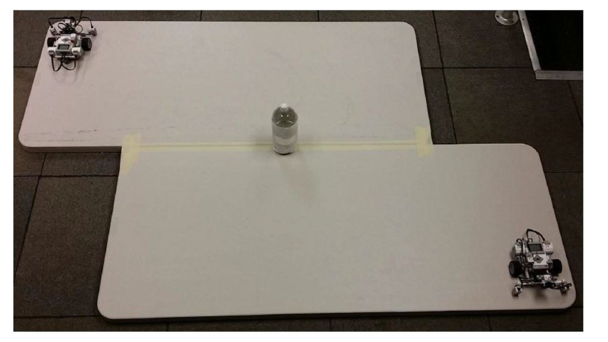

# 2026 Table-Sumo Competition Rules

Revision: `2026 Rev.0`

This is a neutral project reference transcribed from the attached 2026 rules
document. The document name and organizer branding are intentionally omitted.
The live rules publication and the referee committee's decisions control if a
later revision or event-day announcement differs from this reference.

## 1. Event objective

A round is won by either:

1. Finding and intentionally pushing a 2 L water bottle containing about 1 L
   of water off the arena; or
2. Being the last robot remaining on the arena.

After either condition is reached, the winning robot must remain on the arena
for at least 3 seconds. If the robot that pushed the bottle falls off before
3 seconds, the last-robot-standing rule is applied. If the other robot also
fails to remain on the arena for 3 seconds, the round is a draw.

## 2. Divisions and teams

| Division | Participant age | Kit and controller limits |
| --- | --- | --- |
| Junior | 7-12 years old | The listed educational robot kits are permitted; at most 1 controller. |
| Senior | 13-19 years old, including secondary and post-secondary students | Any brand or DIY equipment; at most 2 controllers. |

Age is calculated as of 31 July 2025. Every team must have one responsible
teacher, instructor, or coach. A team may have at most two participants.

## 3. Arena and bottle

- The arena uses rounded-corner fire-resistant wooden boards with a white or
  light-gray laminate surface.
- Each board is 75 cm x 182 cm (30 in x 72 in). The actual surface color is
  announced on the event day.
- The junior division uses a board arrangement similar to the single-board
  example.
- The senior division uses an unknown board arrangement. Two boards may be
  joined with tape in an offset layout. The tape color and material are
  announced during the inspection period.
- The boards may be raised on supports of unknown height.
- The bottle can be placed at any point along the joint line in the senior
  arrangements.
- The bottle is wrapped in white paper and has a colored band. The band color
  and material are announced during the inspection period.
- The bottle is approximately 21.6 cm tall. The band is approximately 3.8 cm
  wide and its center is approximately 8 cm from the bottom. The bottle may be
  upright or lying on its side.

## 4. Robot design requirements

| Requirement | Junior division | Senior division |
| --- | --- | --- |
| Robot kit | Listed educational kits | Any brand or DIY equipment |
| Controllers | At most 1 | At most 2 |
| Motors | Any type | At most 3 |
| Sensors | Unlimited except cameras or similar vision systems | Unrestricted |
| Static size | Diameter at most 30 cm; height at most 30 cm | Diameter at most 30 cm; height at most 30 cm |
| Expanded size | Expansion prohibited | Diameter at most 35 cm; height at most 35 cm |
| Weight | At most 1 kg | At most 1 kg |
| Ground clearance | At least 2 mm, except for movement structures and essential supports | At least 2 mm, except for movement structures and essential supports |
| Battery | Disposable or rechargeable battery output below 14 V | Disposable or rechargeable battery output below 14 V |
| Movement | Any, including walking, tracked, or wheeled | Any, including walking, tracked, or wheeled |
| Programming language | Any | Any |
| Operation | Fully autonomous; remote control may only start the robot | Fully autonomous; remote control may only start the robot |

The following are prohibited:

- Devices that fix the robot to the arena, including suction or vacuum devices.
- Sticky wheels.
- Sharp or pointed metal parts that can damage another robot.

All sensors must be harmless to people. A movement structure includes wheels,
casters, tracks, legs, and similar parts. A support is allowed only when it is
necessary for movement; removing it must make the robot unable to move, such as
by causing it to tip or leaving its tracks or wheels in the air.

Any battery may be used if its output voltage is below 14 V. Except for an
original kit battery, a rechargeable battery declaration must be submitted by
email at least two weeks before the event and accepted before use.

## 5. Inspection period

An inspection period occurs before the competition starts. The following are
announced during inspection:

- The starting position and orientation of each robot.
- The bottle band's actual color and material.
- The tape's actual color and material, if tape is present.

Teams should bring a computer, tools, and spare parts because lighting, floor
conditions, and board color may differ from the training environment. The team
must submit its robot to the inspection area. Staff attach a marker to the
front of the robot so referees can judge intentional bottle pushing.

If a violation is found, the team must return to the preparation area, correct
the robot, and submit it again. After inspection, the robot is stored in the
display area and the team receives a claim card. The card is exchanged to
retrieve the robot before each match and returned when the match ends. Failure
to complete inspection without a special reason results in disqualification.

## 6. Competition format and match procedure

- The competition has a group league followed by a knockout stage.
- The group draw places 2-3 teams in each group. Each team plays every other
  team in its group once.
- The top team from each group advances to the knockout draw. Group winners
  draw their knockout positions and play the opponents assigned to those
  positions. Winners continue through the bracket; after the final-four stage,
  the two losing teams play a third-place match and the two winning teams play
  the championship match.
- Each match is best of three rounds, with a 2-minute limit per round.
- A 30-second repair and adjustment period follows each round.

Before each round, teams place their robots at the announced positions and
orientations. When the referee starts the round, teams may start their robots
with a button or remote. From startup until the round ends:

- All participants must stay at least 1 m away from the arena.
- Participants must not touch the arena or anything on it.
- If a remote starts the robot, it must be placed on the floor near the team's
  feet immediately after the team moves 1 m away.
- A violation loses the round immediately.

If a team does not arrive at the assigned time, the opposing team wins the
match automatically. The winning team's score for that match is recorded as
zero for all rounds.

The robots then attempt to intentionally push the bottle off the arena or to
become the last robot remaining. After a round is decided, teams may adjust
their robots during the 30-second repair period. A robot that does not meet the
design requirements or is not placed correctly after the repair period loses
the round by forfeit. After the match, robots are returned to the display area.

### Draw conditions

Both teams receive one point when any of the following occurs:

- The second robot falls off within 3 seconds of the first robot.
- Neither robot starts within 30 seconds.
- Neither robot has made progress after 30 seconds.
- Neither robot has contacted the other after 30 seconds.
- The robots remain entangled and cannot recover movement for 30 seconds.
- No winner appears within the 2-minute round limit.

A robot is considered unable to continue when any part of it touches the ground
outside the arena. Once that ruling is made, returning to the arena does not
cancel it. A part that completely separates from the robot body and controller
is no longer considered part of the robot; its falling off does not create a
robot-fall ruling. A violation found during a match results in
disqualification.

## 7. Intentional bottle-push ruling

The bottle may be upright or lying on its side.

- **Intentional:** only one robot maintains continuous contact with the bottle
  using its marked front face until the bottle leaves the arena.
- **Unintentional:** one robot uses a side or rear face, or it makes front
  contact and then the bottle falls later, such as during a spin. The match
  continues as a one-on-one sumo match.
- **Unable to determine:** both robots maintain front contact with the bottle,
  or one robot maintains front contact while the other robot continuously
  contacts the pushing robot and contributes to the fall.

## 8. Venue and disputes

- Standard local power outlets are provided. Teams must bring voltage or
  frequency converters and sufficiently long extension cords when needed.
- Lighting is ordinary venue lighting and may change due to sunlight, flashes,
  or other event lights. Teams have calibration time before the competition.
- The arena is installed on the floor. The organizers try to keep it flat, but
  wrinkles or unevenness may occur.
- Unspecified matters are decided by the referee committee at the venue.
- The referee committee has final authority over cases not covered by these
  rules and over the competition as a whole.
- Photos or videos taken by other people are not accepted as appeal evidence.

## Appendix: board arrangement references

The attached rules document illustrates one junior arrangement and two senior
arrangements. In the senior arrangements, the bottle may be placed at any
point along the indicated joint line. The exact arrangement, tape, bottle band,
and starting position are announced during inspection. The appendix also
includes a robot-size measuring reference.
