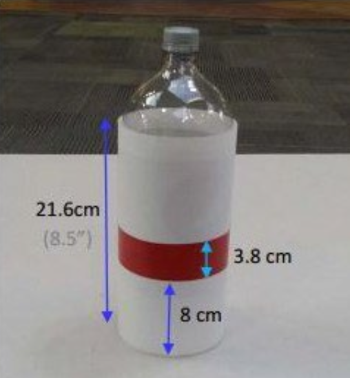
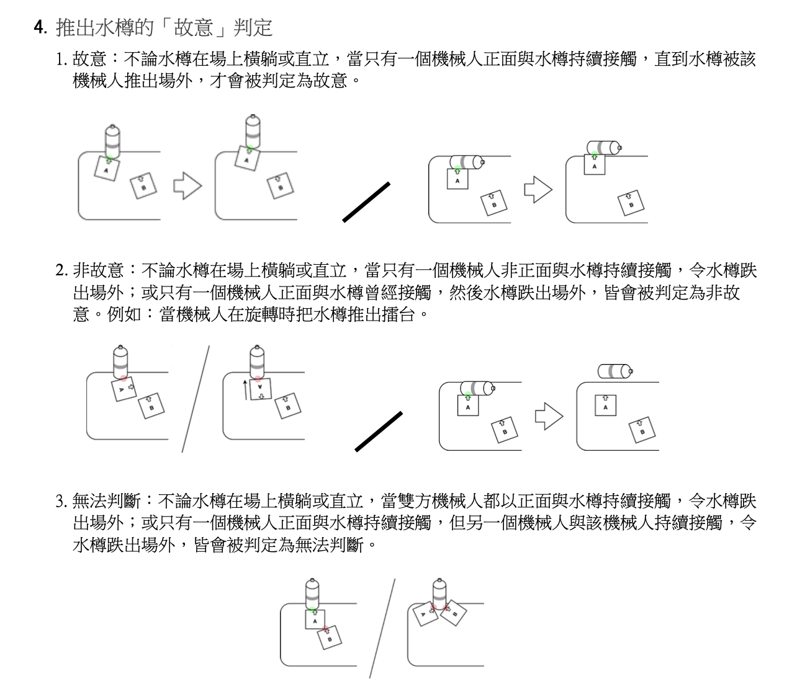

# Autonomous Table-Sumo Robot Competition — Rules Digest (Senior Division)

## Objective
Win a round by either:
1. **Intentionally** pushing a 2 L water bottle (containing ~1 L of water) off
   the table, **or**
2. Being the last robot remaining on the table.

After achieving either condition, the robot **must remain on the table for at
least 3 more seconds** to be declared the winner. If the pushing robot falls
off within 3 s, the "last robot on the table" rule applies. If both robots
fail to stay on, the round is a draw.

## Arena
- Fireproof wooden board(s), **white or light grey** laminate, rounded
  corners, each board **75 cm x 182 cm** (30" x 72"). Actual surface color is
  announced on competition day.
  
- **Senior division uses an UNKNOWN table configuration**: two boards may be
  joined with tape in offset arrangements (L/Z-like non-convex shapes). The
  bottle is placed **at any point along the joint line**.
- Tape color and material at the seam are announced on competition day.
- The table may be **raised on supports of unknown height**.
- Surface flatness is not guaranteed (possible wrinkles/unevenness).
- Venue lighting is ordinary room lighting but **not guaranteed constant**;
  camera flashes and stray light from other events are possible. Teams get
  sensor calibration time before matches.

## The Bottle
- 2 L bottle with ~1 L of water (unknown exact amount), wrapped in white
  paper with a **colored band** (color/material announced on competition day).
- Height ~**21.6 cm**; band is **3.8 cm** wide, positioned **8 cm** from the
  bottom.
- May end up standing upright or lying on its side during play.

## "Intentional" Push Ruling
- A robot's **front face is marked with a sticker** during inspection.
- **Intentional** (wins): one robot maintains continuous FRONT contact with
  the bottle until it leaves the table.
- **Unintentional**: side/rear contact, or brief front contact followed by
  the bottle falling later (e.g. knocked off while spinning). The match then
  continues as one-on-one sumo.
- **Unjudgeable**: both robots front-contact the bottle, or one robot pushes
  the robot that is pushing the bottle.

## Robot Requirements (Senior)
| Item | Limit |
|---|---|
| Kit / parts | Any brand or DIY |
| Controllers | <= 2 |
| Motors | <= 3, any type |
| Sensors | Unrestricted (must be harmless to humans) |
| Size | <= 30 cm diameter, <= 30 cm height |
| Expanded size (after start) | <= 35 cm diameter, <= 35 cm height |
| Weight | <= 1 kg |
| Ground clearance | >= 2 mm (except drive structures / essential supports) |
| Battery | < 14 V output; non-original rechargeables require a declaration form 2 weeks before the event |
| Locomotion | Any (wheels, tracks, legs...) |
| Forbidden | Suction/vacuum devices, sticky wheels, sharp/damaging parts |
| Operation | Fully autonomous; remote may ONLY be used to start the robot, then must be placed on the ground |

## Match Format
- Group league (2-3 teams/group, round-robin) then knockout bracket.
- Each match: **best of 3 rounds, 2 minutes per round**.
- **30-second repair/adjustment window** between rounds.
- Starting position and orientation on the table are **announced on
  competition day** (revealed during robot inspection).
- All team members must stay **1 m away** from the table during a round.

## Draw Conditions (both teams score 1)
- The second robot falls off within 3 s of the first.
- Neither robot starts within 30 s.
- No progress, no mutual contact, or robots entangled for 30 s.
- No winner within the 2-minute time limit.

## Other Notes
- A part that fully detaches from the robot body no longer counts as the
  robot (falling off the table causes no ruling against it).
- A robot ruled "off the table" stays eliminated even if it climbs back on.
- Violations found mid-match result in disqualification; robots are
  inspected and stored at a display area between matches.

